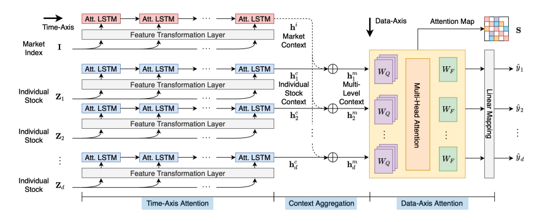

# Accurate Multivariate Stock Movement Prediction via Data-Axis Transformer with Multi-Level Contexts Implementation
This is a Keras implementation of the stock movement prediction model in "Accurate Multivariate Stock Movement Prediction via Data-Axis Transformer with Multi-Level Contexts" (Jaemin Yoo, Yejun Soun, Yong-chan Park, and U Kang, KDD, 2021).  

### The model is consisted of 3 stages
- time axis attention
- context aggregation
- data axis attention

### The model presented compares the performance with two other models 
- https://www.ijcai.org/proceedings/2019/0810.pdf
- Stocknet: https://github.com/yumoxu/stocknet-code

### how to run
python pred_lstm.py -p ./data/kdd17/ -l 5 -u 4 -l2 0.001 -a 0 -f 1

### installation
brew install graphviz
pip install -r requirements.txt
